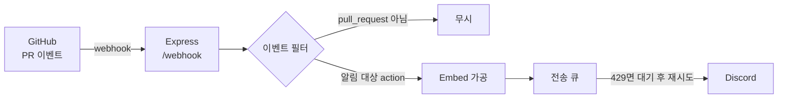

<div align="center">

# GitHub → Discord 웹훅 서버

**팀의 Pull Request 활동을 디스코드로 자동 통보하는 중계 서버**


</div>

---

## 왜 만들었나

언리얼 팀 프로젝트에서 Git 관리를 맡으면서, **누가 무엇을 올렸는지 매번 말로 공유하는 일**이 반복됐습니다.
PR을 올려도 다른 사람이 모르고 지나가거나, 머지된 줄 모르고 옛 브랜치에서 작업하는 일이 생겼습니다.

그래서 GitHub 웹훅을 받아 디스코드로 넘겨주는 중계 서버를 만들었습니다.
지금은 PR이 열리고 닫히는 흐름이 팀 채널에 그대로 남습니다.

---

## 동작



### 알리는 것

| 상황 | action | 색 |
| --- | --- | --- |
| PR 생성 · 재오픈 · 리뷰 준비 | `opened` · `reopened` · `ready_for_review` | 🟢 초록 |
| PR 머지 | `closed` + `merged: true` | 🟣 보라 |
| PR 닫힘 (머지 안 됨) | `closed` + `merged: false` | 🔴 빨강 |

`assigned`, `labeled`, `synchronize` 같은 나머지 action은 무시합니다.
특히 **`synchronize` 는 PR에 커밋을 올릴 때마다 발생**해서, 넣으면 알림이 도배됩니다.

메시지에는 PR 번호와 제목, 작성자, `작업 브랜치 → 대상 브랜치`, 본문 요약, 저장소 이름이 담깁니다.

---

## 만들면서 해결한 문제

### 1. push 알림에서 PR 알림으로

처음에는 `main` 에 push가 들어올 때 알렸습니다.
그런데 팀 규칙을 **"PR을 거쳐 머지"** 로 바꾸면서 push 알림은 의미가 없어졌습니다.
머지된 뒤에야 알림이 오니 리뷰할 시점을 놓쳤기 때문입니다.

`pull_request` 이벤트로 바꾸면서 몇 가지를 알게 됐습니다.

- **PR을 만든 사람과 머지 버튼을 누른 사람이 다르다.**
  `pull_request.user` 는 작성자, `payload.sender` 는 이벤트를 일으킨 사람입니다.
  머지 알림에는 `sender` 를 써야 실제로 누가 머지했는지 남습니다.
- **머지 판별에는 별도 필드가 필요하다.** `action === 'closed'` 만으로는 머지와 그냥 닫힘을 구분할 수 없어 `pr.merged` 를 함께 봅니다.
- **코드만 고쳐서는 동작하지 않는다.** GitHub 저장소 설정에서 구독 이벤트를 Pushes → Pull requests 로 바꿔야 합니다.

### 2. 알림이 몰리면 유실되던 문제

여러 PR이 짧은 시간에 처리되면 디스코드가 **429(Too Many Requests)** 를 돌려주고 알림이 사라졌습니다.
디스코드 웹훅은 URL당 요청 수에 제한이 있습니다.

**전송을 큐로 직렬화하고, 429가 오면 응답이 알려준 `retry_after` 만큼 기다렸다 다시 보냅니다.**

```js
async function sendToDiscordWithRetry(message, retriesLeft = MAX_RETRIES) {
  try {
    await axios.post(DISCORD_WEBHOOK_URL, message);
  } catch (err) {
    if (err.response?.status === 429 && retriesLeft > 0) {
      const waitMs = Math.ceil((err.response.data?.retry_after || 1) * 1000) + 250;
      await sleep(waitMs);
      return sendToDiscordWithRetry(message, retriesLeft - 1);
    }
    throw err;
  }
}

// 모든 전송을 하나의 큐로 직렬화 + 최소 간격 보장
function enqueueDiscordSend(message) {
  const task = sendQueue.then(() => sendToDiscordWithRetry(message));
  // 이번 작업의 성공·실패와 무관하게 다음 작업이 이어지도록 한다
  sendQueue = task.catch(() => {}).then(() => sleep(MIN_SEND_INTERVAL_MS));
  return task;
}
```

`task.catch(() => {})` 가 핵심입니다. 이게 없으면 **한 건이 실패했을 때 큐 전체가 멈춥니다.**

---

## 알아둘 것

**웹훅은 알림이지 차단이 아닙니다.**
`main` 직접 push를 막으려면 Branch protection rule이 필요하고, 웹훅과는 완전히 별개 기능입니다.
정리하면 **막기 = Branch protection, 알리기 = 웹훅** 입니다.

---

## 설치와 실행

```bash
npm install
cp .env.example .env    # 값을 채웁니다
node server.js
```

| 환경 변수 | 설명 |
| --- | --- |
| `DISCORD_WEBHOOK_URL` | 디스코드 채널 설정 → 연동 → 웹훅에서 발급 |
| `PORT` | 기본값 3000 |

### GitHub 설정

저장소 **Settings → Webhooks → Add webhook**

| 항목 | 값 |
| --- | --- |
| Payload URL | `https://<배포주소>/webhook` |
| Content type | `application/json` |
| 이벤트 | *Let me select individual events* → **Pull requests** 체크 |

### 배포

개발 중에는 `ngrok` / `localtunnel` 로 로컬 서버를 잠시 외부에 열어 테스트했고,
운영은 **Render** 무료 웹 서비스에 올려 컴퓨터를 켜두지 않아도 동작하게 했습니다.

무료 플랜은 일정 시간 요청이 없으면 잠들기 때문에, **UptimeRobot으로 주기적으로 깨워** 알림이 늦지 않게 했습니다.
`GET /` 로 헬스 체크에 응답합니다.

```
Server is alive!
```
